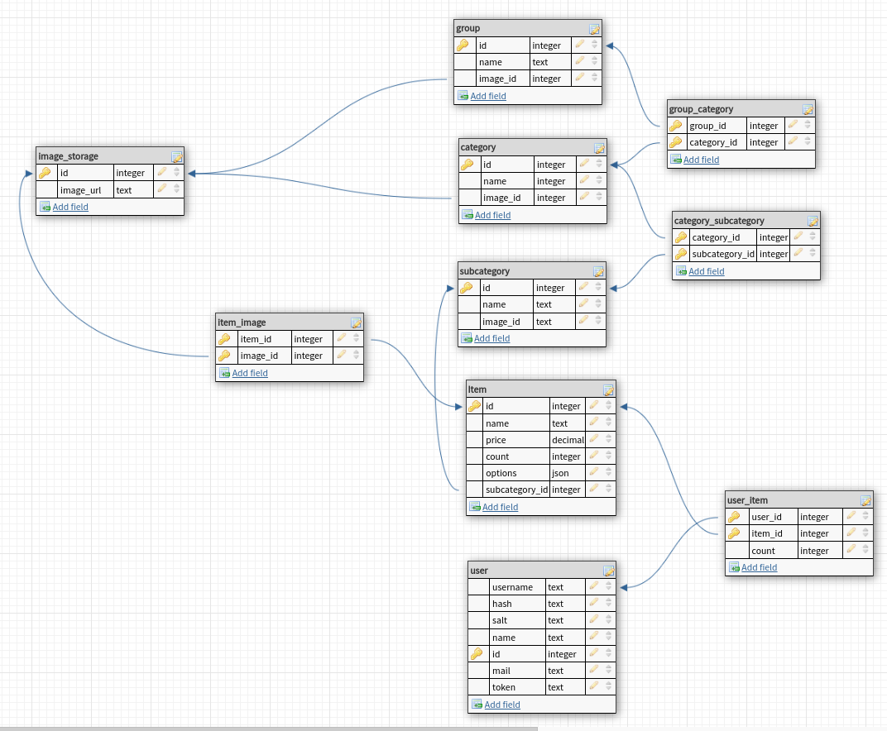

# Схема базы данных:

В качестве базы данных я выбрал Postgres, так как она имеет возможности масштабирования – максимальный размер БД не ограничен, равно как и количество строк/индексов в таблице. 
Также Postgres поддерживает тип json который в данной задаче я планировал использовать для хранения вариативных полей сущности товара.
